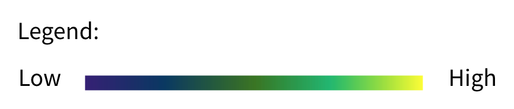

\arrayrulecolor{white}
\definecolor{centreGreen}{HTML}{1bb580}
\definecolor{withNPIColor}{HTML}{d9ead3}
\definecolor{noNPIColor}{HTML}{f4cccc}
\definecolor{withNPIFontColor}{HTML}{20aa6c}
\definecolor{noNPIFontColor}{HTML}{be0003}
\thispagestyle{fancy} 
\lhead{}
\chead{}
\rhead{} 
\lfoot{\fontsize{7}{7}\leavevmode\selectfont\textcolor{gray}{\thepage}}
\cfoot{}
\rfoot{\fontsize{7}{7}\leavevmode\selectfont\textcolor{gray}{The OCHA Centre for Humanitarian Data | Connecting people and data to improve lives}}
\renewcommand{\headrulewidth}{0pt} 
\renewcommand{\footrulewidth}{0.4pt}
\captionsetup[table]{labelformat=empty}

{width=600px}

```{r updated_inputs, echo = FALSE}
country <- 'Democratic Republic of the Congo'
country_iso_3_code <- 'COD'
assignment_date <- params$assignment_date

cfr <- as.numeric('2.5')
npi_projected_cases_4w_LOW <- format(10387, big.mark = ",")
npi_projected_cases_4w_HI <- format(10533, big.mark = ",")
npi_projected_deaths_4w_LOW <-format(273, big.mark = ",")
npi_projected_deaths_4w_HI <- format(285, big.mark = ",")

no_npi_projected_cases_4w_LOW <- format(10563, big.mark = ",")
no_npi_projected_cases_4w_HI <- format(10774, big.mark = ",")
no_npi_projected_deaths_4w_LOW <-format(276, big.mark = ",")
no_npi_projected_deaths_4w_HI <- format(290, big.mark = ",")

hospitalizations_current_LOW <- format(37, big.mark = ",")
hospitalizations_current_HI <- format(65, big.mark = ",")
npi_hospitalizations_LOW <- format(54, big.mark = ",")
npi_hospitalizations_HI <- format(89, big.mark = ",")
no_npi_hospitalizations_LOW <- format(78, big.mark = ",")
no_npi_hospitalizations_HI <- format(130, big.mark = ",")
```

```{r key_messages, echo = FALSE}

# NOTE: each bullet point needs to start with a * followed by a space, and end with a Return when followed by another bullet point

key_messages_current_situation <- "
* A total of 9,890 cases and 251 deaths have been reported. 
* New reported cases and deaths have declined by 14% and 43% respectively with respect to last week.
"   
key_messages_national_projections <- "
* Although the number of new cases shows a decreasing trend, the situation in DRC remains concerning as the number of severe cases is expected to grow in the coming 2 weeks (see section 3).
* Our projections suggest an increase in the cumulative number of cases between 5% and 7% and an increase in the cumulative number of deaths up to 12% in the next four weeks, assuming all current NPIs are maintained. 
* Lifting of NPIs would lead to a larger increase (see sections 2 and 3 for details).
"

key_messages_subnational_projections <- "
* The number of active cases is expected to be stable or slightly decrease in the coming two weeks, with Kinshasa showing a decrease of about 8% (see section 4).
"

```

```{r setup, include = FALSE, message = FALSE, warning = FALSE}
library(tidyverse)
library(knitr)
library(kableExtra)
library(pander)

options(scipen = 999) # effectively remove scientific notation

# compute projection dates
projection_date_4w <- assignment_date + 28
projection_date_2w <- assignment_date + 14

# specify folder locations
#bucky_results_folder <- "Bucky_results"
who_data_filename <- "../WHO_data/WHO-COVID-19-global-data.csv"
#outputs_folder <- "Outputs"

# functions
colorize <- function(x, color) {
  if (knitr::is_latex_output()) {
    sprintf("\\textcolor{%s}{%s}", color, x)
  } else if (knitr::is_latex_output()) {
    sprintf("<span style='color: %s;'>%s</span>", color, 
      x)
  } else x
}
```

```{r population_data, include = FALSE}
#populations <- read.csv("population_sizes.csv")
#country_population_size <- populations %>%
#                            filter(ADM0_NAME == country) %>%
#                            select(POPULATION) %>%
#                            as.numeric()
  
```

```{r who_data, include = FALSE}
who_data <- read.csv(who_data_filename)
who_data$Date_reported <- as.Date(who_data$Date_reported)
current_cum_cases <- who_data %>%
                      filter(Country == country & 
                      Date_reported == assignment_date) %>%
                      select(Cumulative_cases) %>%
                      as.numeric() %>%
                      format(., big.mark = ",")

current_cum_deaths <- who_data %>%
                      filter(Country == country & 
                      Date_reported == assignment_date) %>%
                      select(Cumulative_deaths) %>%
                      as.numeric() %>%
                      format(., big.mark = ",")  
```

```{r graphs, include = FALSE}
cum_cases_graph_path <- paste0("../Outputs/", country_iso_3_code, "/current_cumulative_reported_cases.png")
cum_deaths_graph_path <- paste0("../Outputs/", country_iso_3_code, "/current_cumulative_deaths.png")
new_cases_graph_path <- paste0("../Outputs/", country_iso_3_code, "/current_daily_cases_reported.png")
new_deaths_graph_path <- paste0("../Outputs/", country_iso_3_code, "/current_daily_deaths.png")
hospitalizations_graph_path <- paste0("../Outputs/", country_iso_3_code, "/projection_hospitalizations.png")
subnational_cases_per_100k_graph_path <- paste0("../Outputs/", country_iso_3_code, "/map_cases_per_100k_2w.png")

```

```{r subnational_projections_data, include = FALSE}
subnational_projections_filename <- paste0("../Outputs/", country_iso_3_code, "/ADM1_ranking.csv")
subnational_projections <- read.csv(subnational_projections_filename)
subnational_projections$cases_per_100k_change <- as.numeric(subnational_projections$cases_per_100k_change)

```

# `r paste(colorize('COVID-19 Projections:', 'centreGreen'), colorize(country, 'centreGreen'))`
#### Report Date: `r format(assignment_date, "%d %b %Y")`    

&nbsp;

This report summarizes the COVID-19 model results for Afghanistan, developed by the OCHA Centre for Humanitarian Data in partnership with the Johns Hopkins University Applied Physics Laboratory. These projections are based on COVID-19 cases and deaths data up to `r assignment_date`. The data is sourced from WHO and the MOPH. For dynamic updates to this data and more, see the [HDX COVID-19 Map Explorer](https://data.humdata.org/visualization/covid19-humanitarian-operations/#). For additional information, please contact Leonardo Milano at: <leonardo.milano@un.org>.

{height=30px}

\Large \textbf{1. Key Messages}[^1][^2]

\large \textbf{Current Situation} (as of `r format(assignment_date, "%d %b %Y")`)
\normalsize
`r key_messages_current_situation`

\large \textbf{National Projections} (in the next 4 weeks or by `r format(projection_date_4w, "%d %b %Y")`)
\normalsize
`r key_messages_national_projections`

\large \textbf{Subnational Projections} (in the next 2 weeks or by `r format(projection_date_2w, "%d %b %Y")`)
\normalsize
`r key_messages_subnational_projections`

\newpage

\Large \textbf{2. Key Figures} (as of `r format(assignment_date, "%d %b %Y")`)

\large \textbf{Current situation}

```{r section2_current_figures, echo = FALSE}

# current_figures_path <- paste0("../Outputs/", country_iso_3_code, "/current_figures.png")
# current_severe_path <- paste0("../Outputs/", country_iso_3_code, "/current_severe_figures.png")

data.frame(Cases = current_cum_cases, 
            Deaths = current_cum_deaths,
            Severe = paste0(hospitalizations_current_LOW, " - ", hospitalizations_current_HI)) %>% 
            kable(align = 'c',
                  col.names = c('Reported Cases', 'Reported Deaths', 'Severe Cases Estimate')) %>%
            kableExtra::kable_styling(position = 'center',
                                      font_size = 11) %>%
            row_spec(0, 
                     bold = FALSE,
                     font_size = 12) %>%
            footnote(general_title = paste0("Case Fatality Rate: ", cfr, '%'), 
                     "",
                     title_format = "italic")

```

\large \textbf{Projected situation in the next 4 weeks or by `r format(projection_date_4w, "%d %b %Y")`}

|  | Projected Cases | | Projected Deaths | 
|------------:|:-----|:---------|:------|
| \colorbox{withNPIColor}{With current NPIs maintained} | \textcolor{withNPIFontColor}{`r paste(npi_projected_cases_4w_LOW, " - ", npi_projected_cases_4w_HI)`}| | \textcolor{withNPIFontColor}{`r paste(npi_projected_deaths_4w_LOW, " - ", npi_projected_deaths_4w_HI)` } |
| \colorbox{noNPIColor}{With no NPIs} | \textcolor{noNPIFontColor}{`r paste(no_npi_projected_cases_4w_LOW, " - ", no_npi_projected_cases_4w_HI)`} | | \textcolor{noNPIFontColor}{`r paste(no_npi_projected_deaths_4w_LOW, " - ", no_npi_projected_deaths_4w_HI)` } |


[^1]: \textbf{Reported cases} refers to the number of infections expected to be reported. It takes into account the \textbf{case reporting rate} which corresponds to the estimated number of COVID-19 infections that are actually tested, confirmed and reported. The case reporting rate is calculated based on the reported number of deaths and cases in the last 30 days.

[^2]: \textbf{Severe cases} refers to the number of people which will have severe symptoms and may require healthcare support. It is calculated as a proportion of the reported cases, and is based on planning parameters for case severity and the vulnerability of a given region.

\Large \textbf{3. National Projections}

\large \textbf{Projected situation in the next 4 weeks or by `r format(projection_date_4w, "%d %b %Y")`}

{width=300px} {width=300px}

{width=300px} {width=300px}

\normalsize The figures above show the comparison between the reported cases and data from two different sources (national level data from WHO in light blue and subnational data from the Ministry of Public Health in dark blue) together with the projected trends. The two lines presented correspond to ‘Current NPIs maintained’ and ‘No NPIs in place’ scenarios. 
\newpage

| | Severe Cases (Estimated) |
|------------:|:-----|
| \colorbox{withNPIColor}{With current NPIs maintained} | \textcolor{withNPIFontColor}{`r paste(npi_hospitalizations_LOW, " - ", npi_hospitalizations_HI)`}|
| \colorbox{noNPIColor}{With no NPIs} | \textcolor{noNPIFontColor}{`r paste(no_npi_hospitalizations_LOW , " - ", no_npi_hospitalizations_HI)`} | 

\begin{center}
\includegraphics[width=0.5\textwidth]{`r hospitalizations_graph_path`}
\end{center}

\newpage

\Large \textbf{4. Subnational Projections}

\large \textbf{Projected situation in the next 2 weeks or by `r format(projection_date_2w, "%d %b %Y")`} \footnotesize With current NPIs[^3] maintained

\large \textbf{Cases per 100,000 people}

\begin{center}
\includegraphics[width=0.5\textwidth]{`r subnational_cases_per_100k_graph_path`}
\end{center}

{width=200px}


\large \textbf{Largest Increases and Decreases In Cases}

```{r subnational_increases, echo = FALSE}

computeNbrIncreasingRegions <- function(subnational_projections_dataframe) {
          subnational_projections %>%
          filter(cases_per_100k_change > 0) %>%
          summarise( n = n()) %>%
          as.numeric()
}

produceIncreasesTable <- function(subnational_projections_dataframe) {
  subnational_projections %>%
          filter(cases_per_100k_change > 0) %>% # keep regions with increases
          arrange(cases_per_100k_change) %>% # orders regions from largest to smallest absolute change 
          slice_head(n = 5) %>% # keep top 5 areas 
          select(ADM1_FR, cases_per_100k_change) %>%
          kable(format = 'latex',
                col.names = c("Region", "Change (%)"),
                caption = "Highest Increases") %>%
          row_spec(0, bold = TRUE) %>%
          kable_styling(latex_options = c('striped', 'hold_position'))
}

increases_result <- if (computeNbrIncreasingRegions(subnational_projections) == 0) {
                          "Highest Increases: No region showing an increase in cases."
                          }else{
                          produceIncreasesTable(subnational_projections)
                        }

```


`r increases_result`

&nbsp;

```{r subnational_decreases, echo = FALSE, results = 'asis'}

computeNbrDecreasingRegions <- function(subnational_projections_dataframe) {
          subnational_projections %>%
          filter(cases_per_100k_change < 0) %>%
          summarise( n = n()) %>%
          as.numeric()
}

produceDecreasesTable <- function(subnational_projections_dataframe) {
  subnational_projections %>%
          filter(cases_per_100k_change < 0) %>% # keep regions with increases
          arrange(cases_per_100k_change) %>% # orders regions from largest to smallest absolute change 
          slice_head(n = 5) %>% # keep top 5 areas 
          select(ADM1_FR, cases_per_100k_change) %>%
          kable(format = 'latex',
                col.names = c("Region", "Change (%)"),
                caption = "Highest Decreases") %>%
          row_spec(0, bold = TRUE) %>%
          kable_styling(latex_options = c('striped', 'hold_position'))
}

decreases_result <- if (computeNbrDecreasingRegions(subnational_projections) == 0) {
  "Highest Decreases: No region showing a decrease in cases."
  }else{
  produceDecreasesTable(subnational_projections)
}
```

`r decreases_result`

[^3]: \textbf{Non-pharmaceutical interventions - NPIs} are all measures implemented by different actors with the aim of reducing the spread and the impact of COVID-19. The NPIs currently in place are extracted from the [ACAPS database](https://data.humdata.org/dataset/acaps-covid19-government-measures-dataset) and complemented with additional contextual information provided by our partners in the country. 

\clearpage

\Large \textbf{Background on Model Methodology}
\normalsize

The Centre established a partnership with the Johns Hopkins University Applied Physics Laboratory to develop a COVID-19 model which provides projections and insights related to the **scale** of the crisis, the **duration** of the crisis in a specific location, and how different response **interventions** are expected to impact the epidemic curve.

The team is using an **SEIR (Susceptible, Exposed, Infectious, Recovered)** model of infectious disease dynamics which is considered the simplest and most effective technique used in the literature. The model is based on a progression from susceptible to either recovered or dead. Inputs include the reproduction rate (Ro), case fatality rate (CFR), and estimated probabilities that an individual person may contract COVID-19. The model then simulates an outbreak and provides estimates for cases, hospitalizations, and deaths.

\begin{center}
\includegraphics{visual_assets/seird_with_legend.png}
\end{center}

The key features of the model include:

- **Tuning on reported data** The estimation of the main parameters (mainly the reproduction rate R0 and the case reporting rate) is tuned according to the observed recent trends in reported COVID-19 cases.
- **Subnational** The model provides COVID-19 projections at the subnational level, matching the administrative level at which COVID-19 cases are reported.
- **Spatial spread** The density of roads is used to estimate the expected mobility patterns and to simulate the spread of COVID-19 between administrative units.
- **Population stratification** The model fidelity is increased by taking into consideration:
    + The age structure of the population at the subnational level
    + The expected probability of contact between populations of different age groups, including contacts expected to happen at work, school, home and everywhere else (social mixing)
    + Vulnerability factors such as food insecurity, household air pollution and access to handwashing facilities.
- **Non-pharmaceutical interventions (NPIs)** The model simulates the expected impact of NPIs at the subnational level, and also how the outbreaks is influenced by changing NPIs implemented over time. The NPIs currently implemented can be categorised in three main groups:
    + Mobility based NPIs, which would limit the spread of disease between administrative units (e.g. border closures)
    + Contact based  NPIs, which reduce the probability of contact between specific groups (e.g. shielding of the elderly, closing schools)
    + R0 based NPIs, which reduce the overall reproduction rate (e.g. awareness campaigns, curfews)


